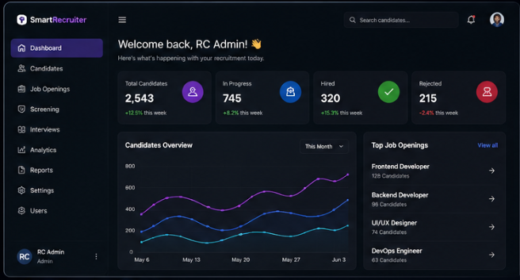
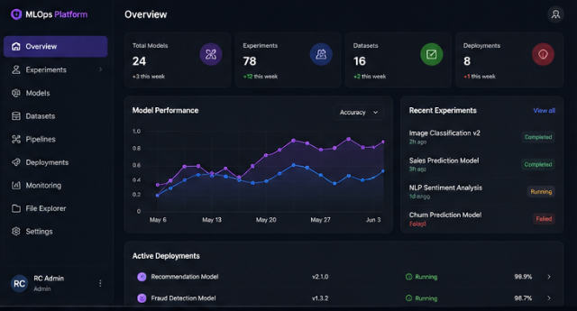
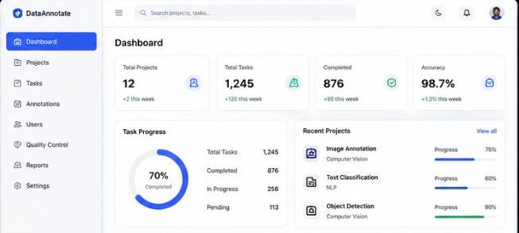
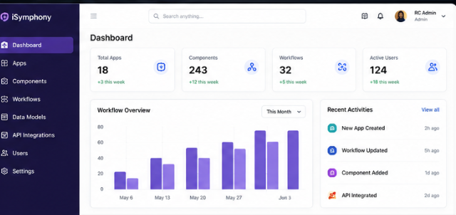

<p align="center">
  
</p>


<h1 align="center">Hi 👋, I'm Siva Bhargav Gandikota</h1>

<h3 align="center">
Frontend Engineer | React Developer | AI-powered Web Applications
</h3>

<p align="center">
  
</p>

---

## 🚀 About Me

```javascript
const rc = {
    role: "Frontend Engineer",
    specialization: [
        "React.js",
        "TypeScript",
        "Redux",
        "AI-powered Applications"
    ],
    
    experience: [
        "Enterprise Recruitment Platforms",
        "Machine Learning Operations",
        "Data Annotation Systems",
        "Low-code Platforms"
    ],

    currentlyLearning: [
        "Selenium",
        "Playwright",
        "AI-assisted Testing"
    ]
};
```


---

## 🛠️ Tech Stack

<p align="center">


</p>


---
## 📌 Featured Projects

<table>
<tr>
<td width="50%">

### 🤖 Smart Recruiter Apps



AI-powered recruitment platform with role mapping, resume analysis, and screening workflows.

⚛️ React • TypeScript • Redux • Material UI

</td>

<td width="50%">

### 🧠 Machine Learning Operations



Enterprise MLOps platform for model management, deployment, and visualization.

⚛️ React • TypeScript • SCSS

</td>
</tr>

<tr>
<td width="50%">

### 🏷️ Data Annotation Platform



Collaborative annotation system with user management and validation workflows.

⚛️ React • Jest • RTL

</td>

<td width="50%">

### ⚡ iSymphony



Low-code platform for building scalable modern applications.

⚛️ React • Redux • JavaScript

</td>
</tr>
</table>
---

## 📈 GitHub Stats

<p align="center">


</p>


---

## 🏆 GitHub Trophy

<p align="center">
  
</p>

---

## 🌐 Connect With Me

<p align="center">

<a href="https://www.linkedin.com/in/siva-bhargav-gandikota/" target="_blank">
  
</a>
  

<a href="https://github.com/Sivabhargav123" target="_blank">
  
</a>


<a href="mailto:gsiva52892@gmail.com">
  
</a>


<a href="https://gsivaportfolio.netlify.app/" target="_blank">
  
</a>

</p>
